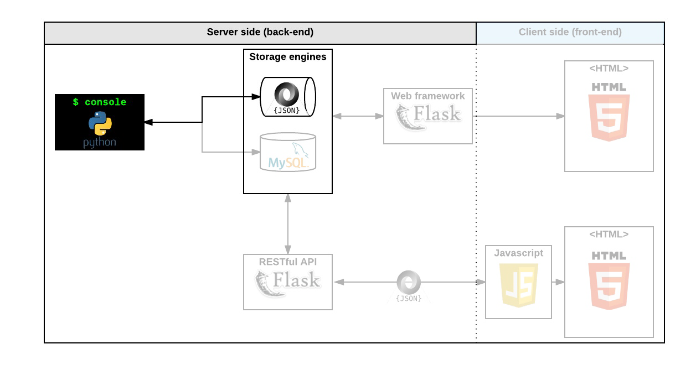

<h1 align="center">AirBnB clone - The console</h1>
<p align="center"></p>
<h2 align="center">Description</h2>

This is the initial stage to build a clone of the **AirBnB** website.
This first step is very important because it will help us develop the next steps in which we will implement: HTML / CSS templates, database storage, API, front-end integration .
We want to be able to manage the objects of our project:

-   Create a new object (ex: a new User or a new Place)
-   Retrieve an object from a file, a database etc…
-   Do operations on objects (count, compute stats, etc…)
-   Update attributes of an object
-   Destroy an object

<p align="center"></p>

<h2 align="center">Command Interpreter</h2>

### How to Use

##### Required environment  📌 
	- Ubuntu 14.04LTS +
	- python3 (version 3.4.3 +)

* Clone the repository
`git clone https://github.com/danielfep03/AirBnB_clone.git`
* Interactive Mode
```
$ ./console.py
(hbnb) create User
e556c44d-eeb2-4c00-900b-f7d0144a2d15
(hbnb) destroy User e556c44d-eeb2-4c00-900b-f7d0144a2d15
(hbnb) show User e556c44d-eeb2-4c00-900b-f7d0144a2d15
** no instance found **
(hbnb) quit
$
```
* Non-Interactive mode
```
$ echo "help" | ./console.py
(hbnb)
Documented commands (type help \<topic\>):
========================================
EOF  help  quit
(hbnb) 
$
$ cat test_help
help
$
$ cat test_help | ./console.py
(hbnb)
Documented commands (type help <topic>):
========================================
EOF  help  quit
(hbnb) 
$
```


|  COMMAND| DESCRIPTION |
|--|--|
| create | Creates a new instance, saves it (to the JSON file) and prints the `id`|
|show| Prints the string representation of an instance based on the class name and `id`|
destroy | Deletes an instance based on the class name and `id`|
|all | Prints all string representation of all instances based or not on the class name|
|update | Updates an instance based on the class name and `id` by adding or updating attribute|

## Authors
#### [Daniel Amado](https://github.com/danielfep03)
#### [Camilo Garzón](https://github.com/Dc-cpu-arch)